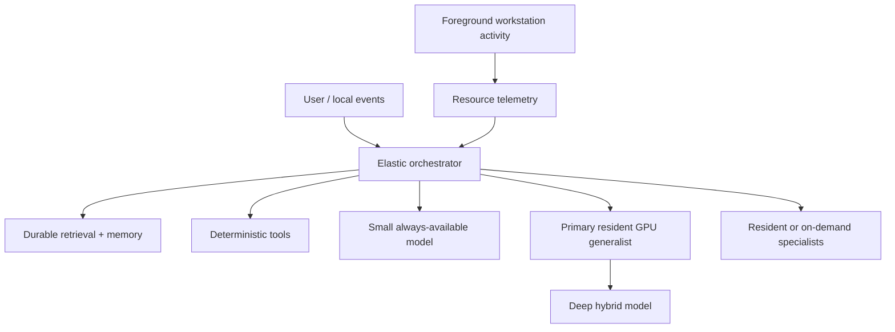
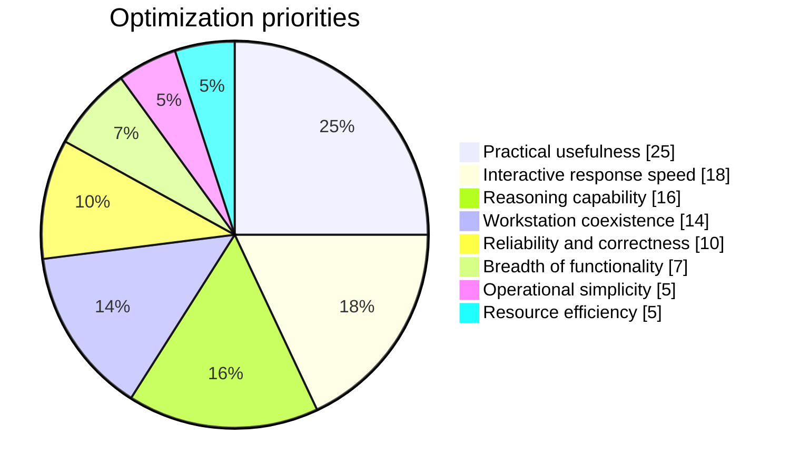

# local-ai 🤖🏠⚡

**Build the most capable, responsive, strictly local personal AI system practical on a single shared workstation.**

`local-ai` is an experiment in **Elastic Resident AI**: a local-first assistant architecture that starts from the strongest useful resident system, measures real interference with everyday creative and development work, and introduces only the narrowest compromises that evidence requires.

> **Start maximal. Measure reality. Compromise narrowly. Restore capability whenever possible.**

---

## What this project is trying to prove 🧪

This repository explores a central question:

> **What architecture makes a single consumer workstation the most useful, capable, and responsive local AI system possible while remaining an excellent general-purpose creative and development machine?**

This is **not** a project to build the smallest AI possible.

It is a project to build a **serious local-only personal AI system** that can coexist well with:

- programming and debugging 💻
- 3D work and rendering 🎨
- digital art and image workflows 🖌️
- compilation, tests, and tooling 🔧
- ordinary desktop and browser use 🌐

---

## Project snapshot 📌

- **Primary architecture:** Elastic Resident AI
- **Operating model:** local-only by default, no silent cloud fallback 🏠
- **Target machine:** a shared AMD workstation with CPU, iGPU, dGPU, RAM, storage, and desktop workloads treated as dynamic shared resources
- **Current emphasis:** establish trustworthy baseline evidence before locking in backend, model, quantization, or resource-reserve assumptions
- **Core discipline:** separate documented fact, target-machine measurement, estimate, community feasibility evidence, architectural judgment, and assumption

---

## The big idea: Elastic Resident AI 🧠

Most local AI designs start cautious: pick a small model, leave large safety margins, and only add capability later.

This project flips that around.

The system should begin with the **strongest useful resident configuration** the machine can plausibly support, then back off only when measurement or user experience shows a real problem.

That means:

1. keep valuable capability resident when it helps;
2. use CPU, GPU, RAM, and VRAM aggressively when that improves usefulness;
3. measure real mixed-workload interference;
4. degrade gracefully only when necessary;
5. restore stronger capability when the constraint disappears.

---

## Architecture at a glance 🗺️

### Permanent substrate
These parts should remain dependable and locally available:

- canonical local state
- retrieval and indexing
- resource telemetry
- deterministic tools
- orchestration
- optionally a tiny always-available model if its cost is negligible

### Elastic inference layer
These parts expand or contract according to real conditions:

- the primary GPU-resident generalist
- larger dense or sparse hybrid models
- embedding and reranking models
- speech, vision, or coding specialists
- deeper capability tiers for harder work

---

## What the project optimizes for 📊

This project does **not** immediately compress all tradeoffs into one score.

Instead, it prefers **Pareto thinking** across:

- capability
- latency
- correctness
- workstation interference

A configuration is valuable if it sits on a useful frontier, even if it is not best at every metric.

---

## Why “resident” matters 💾

Model residency is treated as an advantage until evidence shows otherwise.

A resident model occupying resources is **not waste** if it provides:

- lower time to first token
- faster repeat interactions
- less model-switching overhead
- better day-to-day responsiveness

The question is never *“Is the GPU idle?”*

The question is *“Is this resident capability harming the actual foreground user experience?”*

If not, keeping it warm may be the right decision.

---

## Why “elastic” matters 🔄

Elasticity exists to protect the workstation experience.

When real contention appears, the system should degrade **gracefully** instead of failing awkwardly.

Possible responses include:

1. unload optional specialists
2. pause background indexing
3. reduce concurrency
4. shrink context where acceptable
5. replace or unload a large GPU model
6. move appropriate work to CPU
7. defer deep noninteractive tasks
8. restore stronger capability automatically when resources return

Every compromise should answer four questions:

1. **What measured problem requires it?**
2. **What capability or latency does it cost?**
3. **Is there a narrower compromise?**
4. **Can the lost capability be restored automatically?**

---

## Local-only means local-only 🏠

This repository aims for normal operation that can function **without outbound networking**.

That means preferring:

- local inference
- local retrieval
- local durable memory
- local telemetry
- loopback or Unix-socket APIs
- deterministic local tools
- explicit tool boundaries
- **no automatic cloud fallback**

Networking may still matter for installation, updates, or model acquisition, but the intended system behavior is local-first and locally reliable.

---

## Durable knowledge over chat-only memory 🗃️

Models reason over state.

**Models are not state.**

The long-lived substrate should live outside model weights and transient chat context. That includes:

- structured facts
- provenance
- local documents
- lexical indexes
- semantic indexes
- project knowledge
- user-approved preferences
- task and event records
- system state

The goal is to make model choice replaceable without destroying accumulated knowledge.

---

## Experimental program 🚦

The project is organized as a staged experimental program.

| Gate | Focus | What it answers |
|---|---|---|
| **Gate 0** | Workstation baseline | What is the real machine state and non-AI workload baseline? |
| **Gate 1** | Backend qualification | Which inference backend works best on the target machine? |
| **Gate 2** | Maximal resident baseline | What is the strongest practical resident baseline? |
| **Gate 3** | Specialist expansion | Which small specialist services materially improve usefulness? |
| **Gate 4** | Deep capability frontier | How far can larger hybrid models go before latency or interference becomes unacceptable? |
| **Gate 5** | Mixed-workload contention | How does AI coexist with real workstation activity under load? |
| **Gate 6** | First compromise | What is the narrowest compromise that fixes the first real UX failure? |
| **Gate 7** | Elastic controller | Which proven manual responses are worth automating? |
| **Gate 8** | Retrieval and durable memory | How should persistent local knowledge be structured? |
| **Gate 9** | Integrated assistant | How do inference, tools, retrieval, and resource arbitration work together? |
| **Gate 10** | Long-duration validation | Does the full system remain stable, responsive, and recoverable over time? |

### Current posture
The repository currently emphasizes **evidence-first setup and baseline work** before freezing architectural conclusions that should really be decided by measurement.

---

## Shared-workstation mindset 🖥️✨

This project assumes AI shares the machine with real work.

That means the system must coexist well with:

- active editors and IDEs
- rendering and GPU-heavy tasks
- asset pipelines and compilers
- browsers and normal desktop activity
- creative and technical workflows that may suddenly need CPU, RAM, or VRAM

This is not an AI appliance.

It is a **workstation-first AI architecture**.

---

## Repository guide 🧭

Start here:

- [`PROJECT_PROMPT.md`](PROJECT_PROMPT.md) — project mission, role expectations, architecture priorities, and experimental philosophy
- [`docs/ELASTIC_RESIDENT_AI_DESIGN.md`](docs/ELASTIC_RESIDENT_AI_DESIGN.md) — the primary design document
- [`docs/STEWARD_GUIDANCE.md`](docs/STEWARD_GUIDANCE.md) — independent review guidance and current findings/watch items
- [`roles/PROJECT_STEWARD.md`](roles/PROJECT_STEWARD.md) — the Steward role contract

These documents define the project more precisely than the README can.

---

## Working principles ✅

- **Start from the strongest plausible system**
- **Use measurement, not guesswork**
- **Prefer deterministic software when it is better than inference**
- **Keep model, runtime, quantization, backend, and topology as separate decisions until evidence justifies coupling them**
- **Do not weaken requirements just because a convenient implementation would be easier**
- **Do not optimize isolated AI benchmarks at the expense of actual workstation usefulness**
- **Preserve raw outputs and failed runs as evidence**
- **Keep normal operation local-only**

---

## What success looks like 🌟

A successful outcome is not merely “a local model that runs.”

Success means a system that is:

- genuinely useful
- fast enough to feel responsive
- capable enough to help with serious work
- stable over long sessions
- respectful of the rest of the workstation
- explicit about tradeoffs
- grounded in evidence
- local-first by design

---

## In one sentence 🤏

`local-ai` is a local-only workstation AI project that tries to keep the **best useful AI system resident by default**, then **becomes elastic only where real evidence says it must**.
