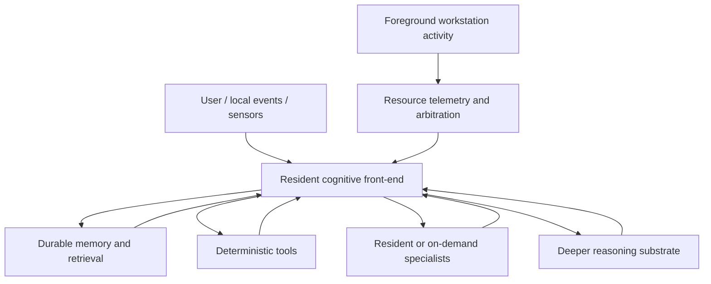

# Cognitive Cascade Design

## Status and relationship to the primary design

This document records an **alternative architectural path** for `loteque/local-ai`.

It does **not** supersede `docs/ELASTIC_RESIDENT_AI_DESIGN.md`.

The Elastic Resident AI remains the primary experimental baseline. This document defines a second path through the design space that may fit the project's local-only, workstation-coexistence, and edge-oriented goals particularly well.

The working idea is that the assistant may be better organized as a **persistent cognitive front-end** over durable memory, deterministic tools, and selectively recruited deeper reasoning rather than as one increasingly large always-resident language model.

This is currently a **project hypothesis**, not a settled project conclusion.

## 1. Motivation

The current project already values:

- local-only operation;
- durable state outside model weights;
- retrieval instead of context inflation where appropriate;
- deterministic tools;
- elastic use of compute resources;
- workstation coexistence.

This alternative design asks whether those principles can be pushed further.

The motivating intuition is:

1. a useful personal assistant may not require its always-awake model to contain most of the system's knowledge or deepest reasoning capacity;
2. a relatively small resident model may be sufficient if it can reliably maintain working state, retrieve durable memory, select tools, and decide when to recruit more compute;
3. larger and more expensive models may be more valuable as intermittent **reasoning substrates** than as the only intelligence present in the system;
4. this division of labor may be especially attractive for edge or local deployment, where responsiveness, privacy, resource elasticity, and graceful degradation matter;
5. nonlinguistic or weakly linguistic internal reasoning systems may eventually use model capacity more efficiently for concepts, relations, and transformations than a system trained primarily for next-token prediction.

In simpler terms:

> The local assistant may work better if the smallest resident model acts as the ongoing "mind" of the system, while memory, tools, specialists, and deeper reasoners provide most of the heavy lifting.

## 2. Core architectural hypothesis

The main hypothesis is:

> A modest local model, paired with strong durable memory, high-quality retrieval, deterministic software, and optional deeper reasoning layers, can function as a highly useful persistent assistant even when its parameter count and active context are much smaller than those of a monolithic large language model.

A stronger form of the hypothesis is:

> In many practical personal-assistant workloads, system capability may scale more with memory quality, retrieval quality, tool quality, and reasoning escalation quality than with the size of the always-resident conversational model alone.

This architecture therefore separates several concerns that are often collapsed into one model:

- language interaction;
- active working state;
- durable memory;
- deterministic capabilities;
- specialist perception or transformation tasks;
- deep reasoning;
- resource arbitration.

## 3. High-level topology

The resident front-end remains continuously available and handles the common path.

The deeper layers are recruited only when they provide enough value to justify their latency, VRAM, RAM, or orchestration cost.

## 4. Architectural interpretation

This design treats the assistant as a system of cooperating functions.

### 4.1 Resident cognitive front-end

This is the smallest continuously available model layer.

Its job is not to know everything.

Its job is to:

- interpret user language and local events;
- maintain short-horizon working state;
- track goals and conversational continuity;
- query memory;
- evaluate whether current information is sufficient;
- choose deterministic tools or specialists;
- decide whether deeper reasoning is needed;
- prepare compact task representations for those downstream systems;
- integrate returned results;
- decide what should become durable memory;
- present results naturally back to the user.

This layer should be:

- fast;
- always available or nearly so;
- cheap enough to keep resident;
- able to degrade gracefully;
- replaceable without destroying durable project or personal state.

This layer may be CPU-resident, low-VRAM GPU-resident, or otherwise kept continuously available depending on measured target-machine behavior.

### 4.2 Durable memory substrate

The durable memory substrate stores information independently of model weights and active context.

Candidate memory forms include:

- canonical structured facts;
- provenance records;
- project and task state;
- user-approved preferences;
- lexical indexes;
- semantic indexes;
- event records;
- document text and metadata;
- summarized or compressed episode records;
- typed relationships between stored entities.

This substrate may evolve from straightforward structured/text retrieval toward richer associative or episodic mechanisms if evidence justifies the added complexity.

### 4.3 Deterministic tools

The design assumes that many tasks should be solved by software rather than inference.

Examples include:

- file and repository inspection;
- structured search;
- scheduling and timers;
- arithmetic;
- parsers and validators;
- telemetry collection;
- local databases and indexes;
- explicit execution policies.

This remains consistent with the project's existing rule that consequential operations should pass through deterministic validation and authorization.

### 4.4 Specialists

Specialists are narrow models or services that perform a task better or more efficiently than the resident front-end.

Examples may include:

- embeddings;
- reranking;
- speech recognition;
- text-to-speech;
- OCR or document processing;
- vision;
- coding assistance;
- local classification or tagging.

They may be resident or on-demand depending on measured benefit.

### 4.5 Deeper reasoning substrate

The deepest layer is a larger, slower, or more specialized reasoning system.

This may be:

- a larger dense language model;
- a sparse MoE model;
- a CPU+GPU hybrid model;
- a tool-augmented solver;
- a graph or program reasoning system;
- a future weakly linguistic or nonlinguistic reasoning model.

The key idea is that this layer need not be the continuously active user-facing agent.

It can instead be recruited when the resident front-end determines that a task exceeds the common path.

## 5. Working-memory model

This design adopts a more explicitly cognitive view of active context.

The active context is treated less like a transcript buffer and more like a working-memory workspace.

A typical working context might contain only:

- the current goal;
- the immediate user request or observation;
- a small number of retrieved memory objects;
- the current plan or unresolved question;
- the most recent action and result.

This leads to a key design question:

> Can the project achieve higher overall usefulness by improving retrieval and reconstruction rather than by maximizing continuously active context length?

The architecture does **not** assume that tiny context is always best.

Instead, it proposes that context size should be treated as a working-memory resource and that larger histories should compete empirically against retrieval-based reconstruction rather than being assumed superior.

## 6. Memory and reconstruction hypothesis

A central conceptual influence on this design is the possibility that useful assistant memory may resemble **compressed reconstructive memory** more than transcript replay.

The system may eventually store and retrieve information at multiple levels, for example:

1. raw documents and events;
2. structured extracted facts;
3. semantic summaries;
4. compressed episode records;
5. linked entities and relationships;
6. progressively consolidated knowledge.

Retrieval may therefore be multi-stage:

- detect the relevant situation;
- retrieve a small cluster of related records;
- reconstruct only the details needed for the present decision;
- optionally write back a better summary or relationship.

The project should not assume that such a scheme outperforms simpler retrieval.

However, it is a promising direction for a persistent local assistant whose useful memory may eventually become much larger than any practical live context window.

## 7. Model modes

This design introduces or clarifies a set of model modes.

These modes are conceptual operating roles. They do not yet prescribe exact model sizes, runtimes, or placement.

### 7.1 Mode A - Resident cognitive mode

Purpose:

- ongoing interaction;
- working-state maintenance;
- memory retrieval and selection;
- tool routing;
- escalation decisions;
- natural user communication.

Typical characteristics:

- small or modest model;
- fast response;
- low steady-state cost;
- strong instruction following and task routing;
- always-on or nearly always-on.

### 7.2 Mode B - Resident generalist mode

Purpose:

- stronger ordinary reasoning and generation than the smallest front-end can provide;
- daily-driver general language work;
- default higher-capability local responses when resources allow.

Typical characteristics:

- GPU-resident when beneficial;
- stronger than Mode A but still expected to remain responsive;
- may be the same model as Mode A in early experiments, or a distinct next tier.

### 7.3 Mode C - Specialist mode

Purpose:

- narrow tasks where dedicated models or software outperform the generalist path.

Typical characteristics:

- task-specific;
- may be resident or on-demand;
- may be deterministic software, not necessarily a learned model.

### 7.4 Mode D - Deep reasoning mode

Purpose:

- hard problems;
- long-horizon reasoning;
- synthesis across many retrieved items;
- tasks where a larger or more specialized inference substrate materially improves quality.

Typical characteristics:

- higher latency tolerated;
- may use CPU+GPU hybrid memory or sparse experts;
- may be activated only on escalation.

### 7.5 Mode E - Latent or nonlinguistic reasoning mode

Purpose:

- future investigation into reasoning systems that operate primarily over entities, relations, constraints, states, or other internal representations rather than user-facing natural language.

Typical characteristics:

- may not be trained primarily as a chatbot;
- may spend more representational capacity on abstraction, world structure, or transformation rules;
- may require a learned or engineered interface between the resident front-end and the deeper reasoner.

This mode is speculative and should be treated as a research direction rather than an implementation commitment.

### 7.6 Mode F - Graceful degradation mode

Purpose:

- preserve useful operation during workstation contention, device failure, or explicit low-resource operation.

Typical characteristics:

- smaller model, reduced concurrency, narrower context, fewer specialists, or deferred deep reasoning;
- automatic restoration of stronger modes when constraints disappear.

## 8. Edge and local-fit hypothesis

This design may be particularly well suited to edge or strictly local deployment.

The reason is that the continuously active layer can stay small while deeper capacity remains recruitable.

Potential advantages include:

- low-latency common-path interaction;
- strong privacy because ordinary memory and interaction remain local;
- graceful degradation when heavier subsystems are unavailable;
- efficient use of shared workstation resources;
- persistent local adaptation through memory rather than weight replacement;
- reduced need for very large always-on context windows;
- a clear path to offline operation.

This path therefore aligns naturally with the project's local-only boundary and shared-workstation philosophy.

## 9. Relationship to Elastic Resident AI

This path should be treated as compatible with, not opposed to, the Elastic Resident architecture.

Possible relationships include:

1. **Interpretation inside Elastic Resident AI**  
   The project keeps Elastic Resident AI as the governing system architecture, while this document refines how the resident layer and deeper layers are conceptually divided.

2. **Alternative operating emphasis**  
   The project explores a more explicitly cognitive version of Elastic Resident AI where the smallest resident layer is primary and larger models are more explicitly recruited as tools or deep reasoning substrates.

3. **Comparative experimental path**  
   The project runs direct experiments comparing a resident-generalist-first workflow against a resident-cognitive-front-end-first workflow.

This document does not currently decide among those three relationships.

## 10. Experimental direction

This alternative path motivates several future experiments once the earlier project gates have produced sufficient workstation evidence.

### 10.1 Routing and escalation effectiveness

Question:

- Can a small resident model correctly decide when a request can be solved locally versus when it should retrieve more memory, call a specialist, or escalate to a deeper reasoner?

Success indicators:

- low unnecessary escalation rate;
- low missed-escalation rate on hard tasks;
- good end-to-end latency on common tasks.

### 10.2 Retrieval versus large live context

Question:

- For realistic personal-assistant and project tasks, does a retrieval-centered working-memory design outperform or match a larger continuously active context at lower resource cost?

Success indicators:

- equal or better correctness;
- lower latency or lower interference;
- stronger provenance and inspectability.

### 10.3 Small-model usefulness with strong memory

Question:

- How small can the continuously resident model be while still remaining useful when backed by durable memory, deterministic tools, and escalation?

Success indicators:

- useful performance on routine interaction;
- acceptable continuity and tool use;
- clear capability gains from memory augmentation.

### 10.4 Cognitive front-end versus resident-generalist baseline

Question:

- Is a cognitive front-end architecture actually better than simply keeping the strongest practical generalist resident?

Success indicators:

- equal or better user usefulness;
- lower interference or better elasticity;
- better persistence and continuity;
- acceptable added orchestration complexity.

### 10.5 Nonlinguistic reasoning interface feasibility

Question:

- Is there a practical interface by which the front-end can hand off compact task state to a deeper reasoning substrate that is not primarily optimized for user-facing language?

Success indicators:

- the interface is inspectable enough to debug;
- the handoff improves problem solving on suitable tasks;
- the integration cost is not prohibitive.

### 10.6 Memory consolidation and associative retrieval

Question:

- Do richer memory representations materially improve long-duration local assistant behavior relative to simpler structured/text retrieval?

Success indicators:

- better recall across long intervals;
- less prompt bloat;
- better contextual continuity;
- measurable user-value improvement that justifies the complexity.

## 11. Risks and caution points

This path introduces meaningful risks.

### 11.1 Premature complexity

A layered cognitive architecture can become an excuse to build a complicated framework before the simple baseline is measured.

The project should resist that temptation.

### 11.2 Weak front-end failure

If the resident front-end is too weak, it may fail at the very tasks that make the architecture viable:

- recognizing what matters;
- selecting the right memory;
- choosing the right tool;
- knowing when to escalate.

### 11.3 Retrieval illusion

A strong memory architecture is only valuable if retrieval is accurate, inspectable, and relevant.

Poor retrieval can make a small model appear worse than it really is.

### 11.4 Orchestration overhead

Added layers may increase end-to-end latency even if each individual component looks efficient.

### 11.5 Interface mismatch

If a nonlinguistic or weakly linguistic deep reasoner is explored, the interface between front-end and reasoner may become the main technical difficulty.

### 11.6 Benchmark ambiguity

Because this design changes the system boundary, naive tokens-per-second comparisons may fail to capture its value or cost.

End-to-end task measurements will matter more.

### 11.7 Personal-memory and governance risk

A persistent assistant that stores and reconstructs meaningful local history needs strong boundaries around what may be remembered, how provenance is preserved, and how consequential actions are authorized.

The project should preserve the existing rule that models may propose actions, but deterministic validation or authorization must decide whether those actions execute.

## 12. Evidence discipline for this path

The project should keep the same evidence standards used elsewhere.

In particular:

- do not assume that a 1B-class model is sufficient without target-machine and task evidence;
- do not assume that smaller context is better without comparative measurement;
- do not assume that richer associative memory beats simpler retrieval without evidence;
- do not assume that a latent or nonlinguistic reasoner is necessary or practical;
- do not let the existence of this document silently replace the Elastic Resident baseline.

This document is intended to preserve a promising architectural direction, not to declare victory for it.

## 13. Provisional design rule

For this alternative path, the provisional design rule is:

> Keep the always-awake layer as small as possible **without** making it too weak to maintain continuity, retrieve memory, select tools, and recruit deeper cognition effectively.

This should be read as a hypothesis to test, not a universal law.

## 14. Summary

This document describes a second path through the local AI design landscape:

- a persistent resident cognitive front-end;
- durable memory outside model weights;
- deterministic tools for reliable operations;
- specialist modules where they help;
- deeper reasoning recruited only when useful;
- possible future exploration of weakly linguistic or nonlinguistic reasoning substrates;
- strong fit for local, edge, and shared-workstation operation.

The key project question opened by this path is:

> How much useful local intelligence can be achieved when the resident model is treated primarily as a coordinator of memory, tools, and deeper cognition rather than as the sole container of intelligence?

That question should remain experimentally open until the project earns an answer.
