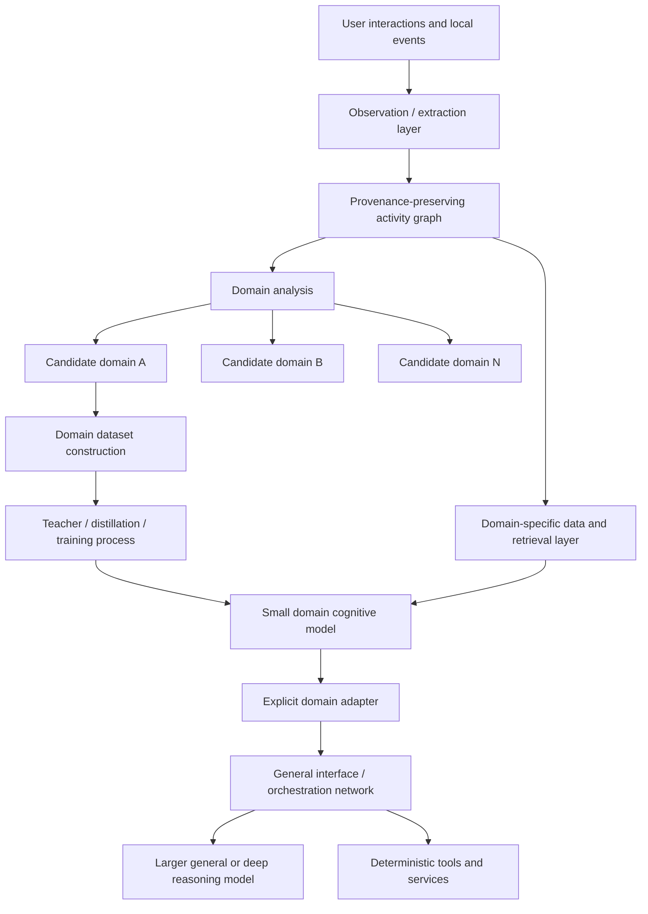
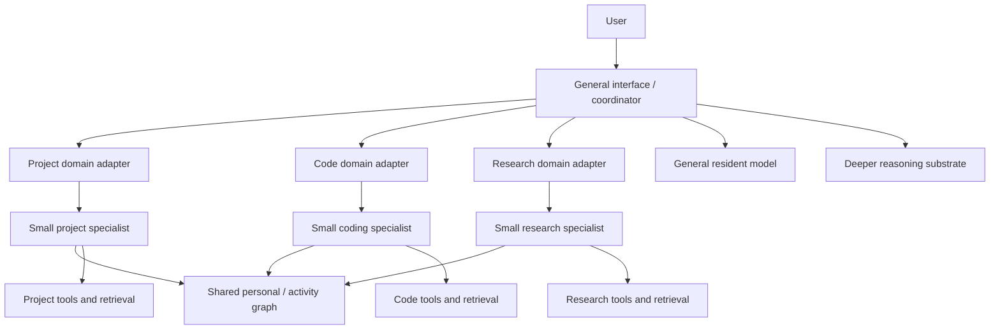

# Domain Crystallization Research Direction

## Status and relationship to current project work

This document records a **deep, long-horizon research direction** for `loteque/local-ai`.

It does **not** supersede `docs/ELASTIC_RESIDENT_AI_DESIGN.md`, activate a new implementation path, or weaken the current maximal-first experimental program.

It is also not evidence that the Cognitive Cascade topology is preferable to the strongest practical resident-generalist baseline. `docs/COGNITIVE_CASCADE_DESIGN.md` remains a hypothesis-bearing design document, and the open Project Steward guidance about premature small-front-end-first framing still applies.

The purpose of this document is narrower: preserve a possible future experiment in which a long-lived local assistant uses accumulated interaction history to discover recurring domains of activity, then distills those domains into small specialized cognitive models while keeping durable facts and authoritative state outside model weights.

The working name for this direction is **Domain Crystallization**.

The name is descriptive, not architectural authority. It refers to the possibility that repeated general-purpose interactions may gradually expose stable domains whose recurring reasoning patterns can be represented by smaller, more specialized learned components.

## 1. Motivation

A long-lived personal AI may eventually accumulate far more interaction history than any practical context window can hold and far more domain-specific behavior than a single monolithic model should be expected to encode efficiently.

At the same time, many recurring user activities may become highly structured over time.

Examples could include:

- project management;
- software development;
- game development;
- documentation work;
- research workflows;
- creative planning;
- machine administration;
- domain-specific analysis.

The research question is whether repeated interaction can be converted into something more useful than an ever-growing transcript archive.

One possible progression is:

1. observe interactions and important state;
2. extract explicit entities, events, relationships, goals, artifacts, decisions, and outcomes into a provenance-preserving graph;
3. analyze that graph to identify recurring domains and stable patterns of work;
4. build a domain-specific data and retrieval layer around one mature domain;
5. use a larger teacher or training process to distill recurring cognitive behavior for that domain into a smaller model;
6. attach that specialist cognition to a shared interface and orchestration layer through explicit adapters;
7. retain a general model or deeper reasoning path for novel, cross-domain, or difficult work.

This suggests a different kind of adaptation from simply expanding context or continually fine-tuning one general model.

The system would attempt to **reorganize computation around repeated work**.

## 2. Primary research hypothesis

The primary hypothesis is:

> A sufficiently rich history of local interaction can expose recurring domains whose characteristic reasoning patterns can be distilled into substantially smaller specialist models, while durable facts, user state, project state, and provenance remain in explicit local data structures.

A stronger form of the hypothesis is:

> For mature recurring domains, a small domain-specialist cognitive model plus a custom retrieval/data substrate and deterministic tools may match or exceed the practical usefulness of a much larger general model on in-domain work, while reducing latency, memory pressure, and unnecessary general-purpose inference.

A still more speculative extension is:

> A long-lived local AI may gradually shift common workloads from expensive general cognition toward smaller learned specialists and deterministic systems, while preserving larger general or deep models for novelty and difficult reasoning.

None of these claims are established project conclusions.

## 3. Proposed conceptual pipeline



The graph, specialist model, retrieval layer, adapter, orchestrator, and deeper model are separate components with separate responsibilities.

They should not be coupled merely because one implementation makes coupling convenient.

## 4. Separation of memory, cognition, and authority

This research direction depends on a strict separation of concerns.

### 4.1 Durable memory is not specialist weights

The activity graph and associated data stores should contain durable knowledge such as:

- entities;
- projects;
- tasks;
- events;
- artifacts;
- decisions;
- relationships;
- user-approved preferences;
- outcomes;
- source provenance;
- timestamps;
- confidence or uncertainty;
- supersession and correction history.

The specialist model should not become the authoritative store for those facts.

A specialist should be replaceable, retrainable, or removable without destroying accumulated knowledge.

### 4.2 Specialist weights represent recurring cognitive behavior

The learned specialist is intended to encode patterns such as:

- how to interpret common domain requests;
- how to decompose recurring problems;
- which relationships usually matter;
- when to retrieve more information;
- which deterministic tools are appropriate;
- how to recognize domain-specific ambiguity or risk;
- how to transform structured state into useful proposals or summaries;
- when the problem exceeds the specialist's competence and requires escalation.

In shorthand:

```text
facts and state      -> graph / database / documents
recurring cognition  -> specialist model or adapter
reliable operations  -> deterministic software
interface contracts  -> explicit adapters / schemas
routing               -> orchestration layer
novel deep reasoning -> larger general or specialist substrate
```

### 4.3 Models propose state; deterministic systems own state transitions

A model may extract candidate observations from interaction history, but model output should not silently become canonical truth.

The durable memory service should preserve enough information to distinguish:

- raw source material;
- extracted claims;
- inferred relationships;
- confidence;
- user-confirmed information;
- machine-measured state;
- corrections;
- contradictions;
- derived summaries.

Consequential actions remain subject to deterministic validation and authorization under the existing project contracts.

## 5. Observation and graph construction

The first technical layer would convert interactions and relevant local events into explicit candidate records.

A small or medium general model could assist with extraction, but it should operate as an interpreter rather than as the authoritative database.

Candidate graph objects might include:

### Entities

- people;
- projects;
- repositories;
- applications;
- devices;
- documents;
- concepts;
- tasks;
- goals;
- tools.

### Relations

- depends on;
- belongs to;
- produced by;
- used by;
- blocks;
- supersedes;
- contradicts;
- derived from;
- relevant to;
- preferred for;
- succeeded or failed under.

### Events

- request;
- decision;
- experiment;
- action;
- correction;
- result;
- failure;
- milestone;
- state change.

The graph need not initially be a dedicated graph database. A relational store with explicit typed edges may be simpler, faster, and easier to inspect. The representation should be selected through requirements and measurement rather than by assuming that a graph database is necessary.

## 6. Domain discovery

The unusual part of this direction is that domains need not all be declared in advance.

Over time, the activity graph may contain dense or recurring structures around particular kinds of work.

Candidate signals for a domain could include:

- repeated entities and artifact types;
- recurring intents;
- recurring tool sequences;
- stable vocabularies;
- repeated decision patterns;
- common dependency structures;
- repeated successful workflows;
- repeated retrieval neighborhoods;
- similar evaluation criteria;
- stable outcome patterns.

Domain discovery could combine deterministic and learned methods, for example:

- graph community detection;
- clustering over embeddings or structured features;
- frequency and recurrence analysis;
- workflow mining;
- model-proposed semantic labels;
- explicit user-defined boundaries.

The system should not assume that every cluster deserves a model.

A useful candidate domain should probably be both **coherent** and **recurrent enough** to justify specialization.

## 7. Domain dataset construction

Once a candidate domain appears mature enough, the system could construct a training and evaluation corpus from its explicit records.

The corpus should distinguish at least:

- input state;
- user intent;
- relevant retrieved evidence;
- available tools;
- correct or accepted action;
- rejected alternatives where available;
- outcome;
- provenance;
- uncertainty;
- later corrections.

Raw personal facts should not be copied indiscriminately into training examples when retrieval would provide them more safely and accurately at runtime.

The goal is to extract **generalizable reasoning behavior from domain history**, not to turn the model into an opaque backup of the user's database.

Synthetic examples generated by a stronger teacher model may be useful for expanding sparse regions of the task distribution, but synthetic material should remain distinguishable from observed interaction evidence.

## 8. Specialist model formation

Several model-formation strategies should remain experimentally separate.

### 8.1 Distillation from a larger teacher

A stronger general or reasoning model could generate high-quality target behavior for domain tasks, then train a smaller student to imitate that behavior.

This is likely the most direct way to ask:

> How much model capacity is actually required once domain breadth is sharply constrained?

### 8.2 Continued domain pretraining

A small pretrained language model could receive additional exposure to domain text, schemas, and structured examples before instruction tuning.

This may improve domain fluency without requiring training from scratch.

### 8.3 Fine-tuning or adapter specialization

A shared small base model could remain general while LoRA-like or other adapter parameters provide domain-specific cognitive behavior.

This would support an architecture in which several domains share language and basic reasoning machinery but activate different learned overlays.

### 8.4 Structured pruning after specialization

A larger model could be specialized to the domain, then progressively pruned while measuring domain task quality.

This would investigate whether significant general-purpose capacity can be removed without damaging the target cognitive workload.

### 8.5 Training from scratch

Training a domain-only model from scratch is possible in principle but should not be assumed optimal.

General language, compositional reasoning, exception handling, temporal concepts, and commonsense relationships may be expensive to relearn from a narrow corpus. Pretraining plus specialization may preserve these capabilities more efficiently.

## 9. Domain-specific data and retrieval layer

Each mature domain may benefit from a retrieval layer shaped around its actual data structures rather than one universal RAG implementation.

For example, a project-management domain might retrieve:

- current goals;
- active tasks;
- dependency chains;
- blockers;
- deadlines;
- recent decisions;
- ownership;
- milestone state.

A software-development domain might instead retrieve:

- repository structure;
- symbols;
- recent commits;
- failing tests;
- issues;
- dependency relationships;
- architectural decisions;
- tool outputs.

The retrieval layer may combine:

- structured queries;
- lexical search;
- semantic retrieval;
- graph traversal;
- recency;
- source authority;
- domain-specific ranking.

The specialist model should consume compact, explicit state rather than requiring large transcript replay whenever practical.

## 10. Adapters and general orchestration

A domain specialist should not need to own the entire user interface.

A shared interface or orchestration network could provide:

- natural-language interaction;
- domain selection;
- request routing;
- adapter activation;
- cross-domain coordination;
- escalation to larger models;
- response integration;
- resource arbitration.

A domain adapter would provide an explicit contract between the shared layer and specialist cognition.

That adapter might define:

- accepted task representation;
- domain state schema;
- retrieval interface;
- available tools;
- expected outputs;
- confidence reporting;
- escalation conditions;
- error states.

This makes domain specialization inspectable and replaceable rather than relying on hidden prompts or accidental conventions.

## 11. Possible mature topology

One speculative endpoint could look like:



This is not a proposed current implementation topology.

It is a target shape worth preserving for later experiments if earlier evidence makes it relevant.

## 12. Key research questions

### 12.1 Can useful domains be discovered reliably?

Do graph and interaction patterns produce stable, coherent domains, or do they fragment into arbitrary clusters?

### 12.2 How much history is needed before a domain is mature enough to specialize?

A domain may require sufficient diversity, recurrence, corrections, and successful outcomes before training data becomes useful.

### 12.3 What belongs in weights versus retrieval?

How much domain behavior should be learned, and how much should remain explicit state or deterministic logic?

### 12.4 How small can a competent domain cognitive model become?

Does a 300M, 500M, 1B, or larger model provide the best domain frontier? The answer should be measured rather than assumed.

### 12.5 Does specialization beat an equivalently sized generalist?

A specialist should be compared against both:

- a general model of similar size and runtime cost;
- the stronger general or deep model that produced or supervised its training data.

### 12.6 Does specialization preserve escalation judgment?

A specialist that is excellent in-domain but confidently mishandles out-of-domain requests may be dangerous to route automatically.

### 12.7 Can adapters compose across domains?

Real tasks may span projects, code, research, scheduling, and communication. The system should test whether multiple specialists can cooperate without brittle prompt choreography.

### 12.8 How quickly do domains drift?

A useful specialist may decay as projects, tools, user habits, or terminology change. The system needs evidence about retraining cadence, adapter replacement, and data-window selection.

### 12.9 Is the training cost justified?

Local specialization is only useful if the total cost of data preparation, training, evaluation, maintenance, and orchestration produces enough practical value.

## 13. Experimental sequence

This direction should begin only when the project has adequate durable-memory infrastructure and enough domain evidence to test it honestly.

A plausible sequence is:

### Phase A: synthetic domain feasibility

Use a deliberately bounded domain with a controlled synthetic or public corpus.

Question:

- Can a small specialist measurably outperform a similar-size generalist on a narrow task distribution while retaining reliable abstention or escalation?

### Phase B: graph extraction quality

Measure extraction from representative interaction logs into explicit structured records.

Success requires:

- high precision on important entities and relations;
- preserved provenance;
- correct handling of correction and supersession;
- low silent invention rate.

### Phase C: domain discovery stability

Run domain discovery over accumulated graph state and test whether discovered domains remain stable under new data.

Success requires:

- interpretable clusters;
- repeatability;
- useful boundaries;
- low sensitivity to small input changes.

### Phase D: first real domain specialist

Choose one mature, bounded domain and construct a specialist training and evaluation set.

Project management is an attractive conceptual candidate because much of its authoritative state can remain structured while the model focuses on interpretation, prioritization, decomposition, risk recognition, and communication. This is an example, not a current model-selection decision.

### Phase E: specialist versus generalist comparison

Compare at least:

- small general model;
- domain specialist of similar resource cost;
- larger teacher/general model;
- deterministic plus retrieval baseline where applicable.

Measure:

- correctness;
- useful task completion;
- latency;
- prompt-processing cost;
- memory footprint;
- escalation accuracy;
- robustness to unfamiliar inputs;
- workstation interference.

### Phase F: integrated domain routing

Connect the specialist through an explicit adapter to the shared interface and measure whole-interaction performance.

The specialist is only useful if routing, retrieval, adapter translation, and response integration do not erase its gains.

### Phase G: longitudinal adaptation

Only after the earlier phases succeed should the project investigate repeated domain retraining or adapter refresh over long periods.

This phase would test whether the system can adapt to changing work without destroying useful prior capability or corrupting durable memory.

## 14. Evaluation criteria

A domain specialist should not be declared successful because it performs well on a few familiar examples.

Evaluation should include:

- held-out in-domain tasks;
- adversarially similar out-of-domain tasks;
- mixed-domain tasks;
- stale or contradictory graph state;
- retrieval failures;
- missing information;
- tool failures;
- requests requiring escalation;
- previously unseen phrasing;
- changed project conventions;
- long-horizon drift.

Useful measurements include:

- domain task success rate;
- factual correctness against authoritative state;
- unsupported-claim rate;
- missed-escalation rate;
- unnecessary-escalation rate;
- retrieval precision and recall;
- latency distribution;
- RAM / VRAM footprint;
- model-load time;
- training and refresh cost;
- workstation interference;
- correction recovery;
- provenance preservation.

## 15. Failure and rejection conditions

This direction should be weakened or rejected if evidence shows that:

- domain discovery is unstable or semantically arbitrary;
- graph extraction produces too many high-impact errors;
- maintaining the graph costs more than it returns;
- specialists fail to outperform equivalent small generalists;
- specialists lose too much general reasoning needed for domain work;
- out-of-domain detection is unreliable;
- orchestration overhead erases latency or resource gains;
- specialist maintenance becomes operationally expensive;
- adapter composition becomes brittle;
- domain drift requires constant retraining;
- factual knowledge leaks into weights in ways that are hard to correct or delete;
- a larger resident generalist remains simpler and better on the practical frontier.

A negative result would still be useful project evidence.

## 16. Privacy, correction, and deletion requirements

Because this direction depends on long-lived interaction history, privacy and data lifecycle behavior are first-class technical requirements rather than later polish.

A future implementation should be able to answer:

- what source caused this record to exist?
- was it observed, inferred, generated, or user-confirmed?
- which specialist datasets included it?
- which trained artifacts may have incorporated it?
- can the source record be corrected or deleted?
- can derived graph records be recomputed?
- when does a model require retraining to forget learned behavior derived from removed data?

This is another reason to keep personal facts in explicit retrieval structures whenever possible and reserve model training for generalizable domain behavior.

## 17. Relationship to Elastic Resident AI and Cognitive Cascade

This research direction is compatible with the existing project architecture but does not require the project to adopt a small-front-end-first topology.

Under Elastic Resident AI, domain specialists could simply become optional resident or on-demand capabilities selected when they improve the measured frontier.

Under a future evidence-supported Cognitive Cascade interpretation, they could become more central cognitive components recruited by a persistent front-end.

In either case:

- the strongest practical resident baseline must still be measured first;
- model size is not pre-decided;
- backend, quantization, topology, and specialization method remain separable;
- the system must remain local-only during normal operation;
- deterministic tools remain preferred where inference is unnecessary;
- durable knowledge remains external to model weights;
- specialist value must be established by controlled end-to-end comparison.

## 18. Relationship to current project gates

This is not current-gate work.

The idea depends on infrastructure and evidence that are expected much later, especially:

- trustworthy durable memory and retrieval;
- representative accumulated interaction data;
- explicit provenance and correction semantics;
- stable evaluation tasks;
- measured generalist and specialist baselines;
- an integrated orchestration layer.

It therefore belongs conceptually beyond the early workstation, backend, residency, and coexistence gates.

The present value of this document is to preserve the hypothesis without allowing it to distort current experiments.

## 19. Summary

Domain Crystallization asks whether a long-lived local AI can gradually transform repeated interaction into specialized local cognition.

The proposed direction is:

1. preserve interactions and important state as provenance-bearing explicit data;
2. construct an activity graph without treating model extraction as authoritative truth;
3. identify recurring, coherent domains from accumulated structure;
4. build domain-specific retrieval and deterministic capabilities;
5. distill recurring domain reasoning into small specialist models or adapters;
6. connect those specialists through explicit contracts to a shared general interface and orchestrator;
7. retain larger general or deep models for novelty, difficult reasoning, and cross-domain work;
8. evaluate whether the resulting system actually improves usefulness, latency, correctness, and workstation coexistence.

The deepest hypothesis is not merely that a model can be personalized.

It is that a persistent local AI might eventually **reorganize its own computational architecture around the domains that repeatedly matter**, moving stable work toward compact specialist cognition while keeping memory explicit, inspectable, correctable, and local.

That is a research direction to earn through evidence, not an architecture to assume in advance.
