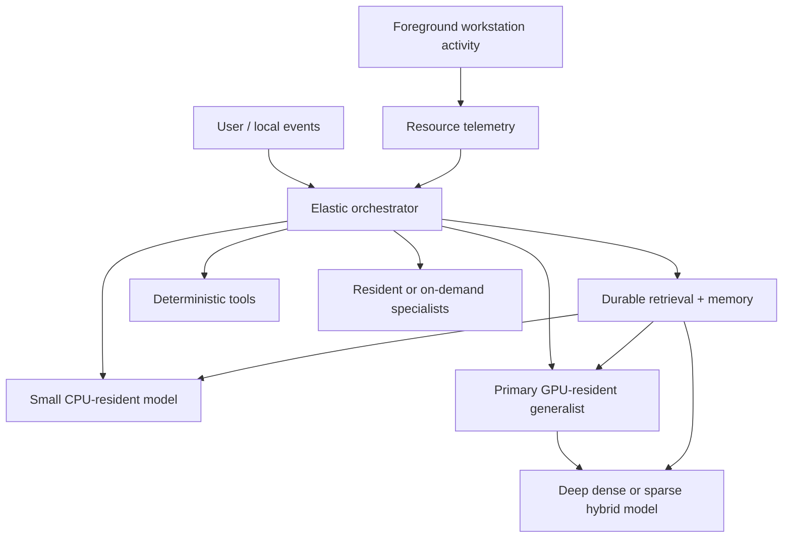

# Elastic Resident AI Design

## Abstract

This document defines the primary experimental architecture for the local-ai project: an Elastic Resident AI that treats a single consumer workstation as a shared, dynamically allocatable compute environment rather than as either a dedicated AI appliance or a machine from which AI must constantly retreat. The initial implementation should target the most capable and responsive system that is theoretically practical on the target hardware, using resident models, CPU and GPU concurrency, large RAM capacity, retrieval, specialists, and aggressive use of available compute. Resource compromises are introduced only when real measurements, foreground creative workloads, or user experience demonstrate that they are necessary. Competing architectures are therefore interpreted primarily as progressively more constrained operating envelopes of the elastic system rather than as co-equal starting points.

## 1. Target workstation

Primary target:

- AMD Ryzen 7 4700G, 8 cores / 16 threads, integrated Radeon graphics, PCIe 3.0.[^amd-cpu]
- AMD Radeon RX 6800 with 16 GB GDDR6 and 512 GB/s memory bandwidth.[^amd-gpu]
- 64 GB system RAM.
- Arch Linux x86-64.
- Approximately 1.1 TB local storage.
- Daily-driver use alongside programming, 3D game development, rendering, and digital art.

The workstation is a shared system. AI is a first-class workload, but not the exclusive owner of the machine.

## 2. Design philosophy

The project starts from an intentionally ambitious premise:

> Build the most useful and responsive local AI system this workstation can plausibly sustain, then add compromises only when evidence shows they are required.

This reverses a conservative design process that begins with minimal resource use and adds capability later.

The experimental order is:

1. maximize useful residency and immediate capability;
2. maximize response speed;
3. use CPU, GPU, RAM, VRAM, and specialists concurrently when beneficial;
4. observe interference with real workstation workloads;
5. introduce elasticity where contention appears;
6. preserve as much capability and responsiveness as possible while resolving the specific contention;
7. repeat until the integrated workstation UX is acceptable.

The system should not preemptively sacrifice capability to hypothetical contention.

## 3. Core topology



The architecture has a permanently available local substrate and an elastic inference layer.

### Permanent substrate

Prefer to keep these continuously available:

- canonical local state;
- SQLite / FTS5 retrieval;
- semantic index metadata;
- orchestration;
- resource telemetry;
- deterministic tools;
- optionally a small CPU model if its RAM/CPU cost is negligible in normal use.

### Elastic inference layer

The GPU and large-model layer expands or contracts according to actual available resources and task requirements.

Candidate components include:

- a strong approximately 9B-class GPU-resident generalist;
- a larger dense CPU+GPU hybrid model;
- a sparse MoE CPU+GPU model;
- embedding and reranking models;
- speech recognition and synthesis;
- vision models;
- coding or other specialists where they measurably improve results.

## 4. Default assumption: residency is valuable

Model residency reduces model-load latency and improves interactive response time.

Therefore, the default experiment should keep the strongest useful generalist resident on the RX 6800 whenever doing so does not measurably degrade the current foreground workload.

Do not unload a model merely because the machine is temporarily idle.

Residency should be evaluated by:

- VRAM footprint;
- model reuse frequency;
- reload time;
- time-to-first-token benefit;
- prompt-processing latency;
- foreground VRAM requirements;
- observed interference.

A resident allocation that causes no relevant user-facing interference is not considered waste.

## 5. Resource elasticity

Elasticity is a response to observed contention, not the primary optimization target.

The resource manager should observe at least:

- committed and free VRAM;
- GPU utilization and clocks;
- GPU temperature;
- system RAM availability;
- swap activity;
- CPU utilization and load;
- storage I/O;
- active AI models;
- model context allocation;
- foreground applications or workload signals where observable.

It may respond by:

1. unloading optional specialist models;
2. shrinking model context where acceptable;
3. reducing AI concurrency;
4. pausing indexing or background jobs;
5. unloading or replacing the primary GPU model;
6. moving a request to a CPU-resident model;
7. switching from the resident model to a different quantization or size;
8. deferring a noninteractive deep job;
9. restoring capability automatically when resources become free.

The order should be driven by measured UX cost.

## 6. Workstation coexistence

The machine must remain useful for:

- Godot or other game-engine editing;
- 3D viewport work;
- GPU rendering;
- shader compilation;
- asset processing;
- digital painting and image editing;
- IDEs and language servers;
- project compilation and tests;
- web browsing and ordinary desktop use.

A successful AI configuration must therefore be benchmarked in two contexts:

### Isolated AI performance

Measure:

- task quality;
- time to first token;
- prompt tokens/s;
- generation tokens/s;
- model-load time;
- VRAM and RAM use;
- backend stability.

### Mixed-workload performance

Measure both AI degradation and foreground degradation during:

- AI + game-engine editor;
- AI + 3D viewport;
- AI + GPU render;
- AI + compilation;
- AI + image editing;
- AI + browser / daily-driver load.

Useful coexistence metrics include:

- viewport frame rate and frame-time variance;
- render-time change;
- compile-time change;
- desktop latency;
- VRAM pressure;
- swap pressure;
- AI latency change;
- task completion quality.

## 7. Optimization frontier

The primary frontier is three-dimensional:

> capability vs response latency vs workstation interference

Do not collapse this immediately into a single score.

Preserve Pareto-optimal configurations.

Examples:

- a 9B resident model may be the best daily-driver configuration;
- a 27B hybrid may be worth activating for deep work;
- a 35B-A3B sparse model may outperform the dense deep tier if its DDR4/PCIe behavior is acceptable;
- a smaller fallback may be appropriate only while a 3D application consumes most VRAM.

The project should discover these envelopes experimentally.

## 8. Relationship to previous competing designs

Earlier designs remain useful, but their role changes.

### Resident Generalist

This becomes the first and least compromised operating envelope of Elastic Resident AI.

### Sparse MoE Workhorse

This becomes a candidate deep-capability expansion path inside Elastic Resident AI.

### Power-Gated / Multi-Tier Cascade

This becomes a constrained operating envelope used when resource contention or UX demonstrates that dynamic retreat is necessary.

### CPU-only or minimal modes

These are fallback envelopes for severe GPU contention, recovery, or explicit user preference.

Thus the project no longer begins by choosing among mutually exclusive topologies. It begins with the elastic superset and discovers where compromises are actually required.

## 9. Backend policy

Treat backend choice as independent from topology.

First-class candidates:

- Ollama with ROCm/HIP;
- llama.cpp with HIP;
- llama.cpp with Vulkan;
- Ollama with Vulkan;
- CPU inference where useful.

The RX 6800 is gfx1030-class hardware. Ollama has previously listed the RX 6800 among AMD acceleration targets.[^ollama-amd] ArchWiki documents `ollama-rocm` and compatibility techniques for ROCm recognition issues.[^archwiki-ollama] A Manjaro user has reported successful `ollama-rocm` operation on a nearby RDNA2 RX 6700 XT using gfx1030-related overrides.[^openwebui-rocm]

AMD's current Linux ROCm support matrix does not officially list the consumer RX 6800, even though it lists other gfx1030 devices.[^rocm-linux]

Therefore:

- ROCm/HIP is a serious first-class candidate;
- Vulkan is a serious first-class candidate;
- native RX 6800 detection should be tested before compatibility overrides;
- the active backend must be verified through logs and telemetry rather than inferred from package name.

## 10. iGPU strategy

Test using the 4700G integrated Radeon GPU for desktop display duties while leaving the RX 6800 primarily available to high-performance workloads.

```text
4700G iGPU  -> compositor / displays
RX 6800     -> AI / 3D / rendering / compute
```

The purpose is not primarily electrical efficiency. It is to reduce unnecessary dGPU desktop residency and free more RX 6800 resources for whichever high-value workload currently needs them.

This is an experiment, not an assumption.

## 11. Durable knowledge and tools

Models reason over state. Models are not state.

Persistent information should live in local systems such as:

- SQLite canonical state;
- SQLite FTS5 lexical search and BM25 ranking;[^sqlite]
- semantic indexes;
- provenance records;
- project knowledge;
- user-approved preferences and state;
- local documents and extracted text;
- task and event records.

Use deterministic software when it is faster, more precise, or more reliable than inference.

## 12. Local-only boundary

Normal operation must be capable of functioning without outbound networking.

Prefer:

- loopback or Unix-socket inference APIs;
- local-only retrieval and memory;
- local telemetry and logs;
- dedicated service users where useful;
- explicit tool capabilities;
- no automatic cloud fallback;
- separate installation/update phases for network-dependent acquisition.

## 13. Experimental program

### Gate 0: hardware and coexistence baseline

Measure the workstation without AI, including representative creative and development workloads.

### Gate 1: backend qualification

Using the same model, quantization, context, and prompts, compare ROCm/HIP and Vulkan paths.

### Gate 2: maximal resident baseline

Find the strongest model/quantization that can remain GPU-resident while delivering excellent interactive latency under a lightly loaded workstation.

This is the primary starting point.

### Gate 3: specialist expansion

Add embeddings, reranking, speech, vision, and other specialists when they improve usefulness or latency.

### Gate 4: deep capability expansion

Test larger dense and sparse hybrid models using the 64 GB host memory and RX 6800 together.

### Gate 5: mixed-workload contention

Run realistic 3D, art, development, and daily-driver workloads against the maximal system.

Identify actual contention rather than hypothetical contention.

### Gate 6: first compromise

Introduce the smallest resource compromise that resolves the first measured UX problem.

Examples:

- unload one specialist;
- reserve more VRAM;
- shrink context;
- lower concurrency;
- switch the deep model;
- defer background indexing.

Re-measure.

### Gate 7: elastic controller

Automate only the compromises that have already proven useful manually.

### Gate 8: integrated long-duration validation

Test resource reclamation, model restoration, GPU recovery, memory leaks, thermal behavior, restart recovery, and offline operation over realistic long-duration use.

## 14. Experimental discipline

For every consequential result record:

- model identifier and hash;
- quantization;
- runtime and version/commit;
- backend;
- build flags;
- launch flags;
- context size;
- GPU offload;
- resident model set;
- VRAM and RAM allocation;
- kernel and driver versions;
- foreground workload;
- cold or warm state;
- raw benchmark output.

Do not declare a winner from one favorable run.

## 15. Design rule for compromises

Every compromise must answer four questions:

1. What measured problem requires this compromise?
2. What capability or latency does the compromise cost?
3. Is there a narrower compromise that solves the same problem?
4. Can the system automatically restore the lost capability when the constraint disappears?

If there is no measured or user-experienced problem, prefer the less compromised configuration.

## 16. Project north star

The project is not trying to build the smallest AI that can coexist with a workstation.

It is trying to build the **most capable and responsive local AI workstation possible**, then make that system elastic enough to remain excellent for programming, 3D game development, art, and ordinary daily use.

Start maximal.

Measure reality.

Compromise narrowly.

Restore capability whenever possible.

[^amd-cpu]: AMD, Ryzen 7 4700G specifications: https://www.amd.com/en/support/downloads/drivers.html/processors/ryzen/ryzen-4000-series/amd-ryzen-7-4700g.html
[^amd-gpu]: AMD, Radeon RX 6800 specifications: https://www.amd.com/en/products/graphics/desktops/radeon/6000-series/amd-radeon-rx-6800.html
[^ollama-amd]: Ollama, AMD graphics support announcement: https://ollama.com/blog/amd-preview
[^archwiki-ollama]: ArchWiki, Ollama: https://wiki.archlinux.org/title/Ollama
[^openwebui-rocm]: Open WebUI discussion #3554, Manjaro + ollama-rocm + RX 6700 XT example: https://github.com/open-webui/open-webui/discussions/3554#discussioncomment-10030355
[^rocm-linux]: AMD ROCm Linux system requirements and supported GPUs: https://rocm.docs.amd.com/projects/install-on-linux/en/docs-7.2.2/reference/system-requirements.html
[^sqlite]: SQLite FTS5: https://www.sqlite.org/fts5.html
